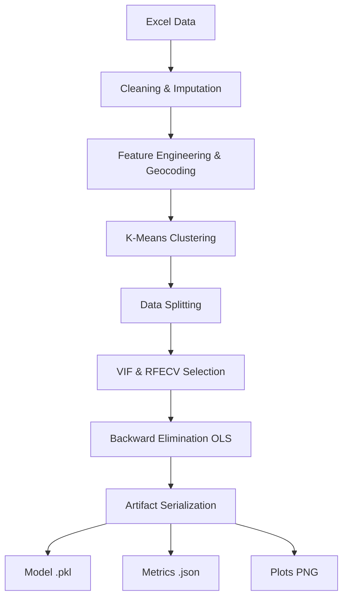

# Madrid Rent Valuation - Modular MLOps Pipeline

This repository is an end-to-end Machine Learning pipeline that predicts apartment rents in Madrid. Originating from a monolithic Jupyter Notebook, the project has been refactored into a highly modular, testable, and robust MLOps Python package.

## 🎯 What the Project Does

The goal of this project is to create an accurate valuation model for the **Rent** (log-transformed as `log_rent`) of different properties in Madrid. 
The pipeline automatically handles:
- **Missing Value Imputation**: Logical rules (e.g. Studios = 0 bedrooms) and hierarchical mode filling without data leakage.
- **Feature Engineering**: Geospatial API enrichment computing distances to Puerta del Sol, K-Means clustering for Mega-District segmentation.
- **Feature Selection**: Variance Inflation Factor (VIF) filtering, Recursive Feature Elimination with Cross-Validation (RFECV), and backward elimination techniques using Ordinary Least Squares (OLS) bounds.
- **Evaluation**: Residual plotting and logging of MAE, RMSE, and MAPE scores.

## 📂 Directory Structure & Module Rationale

The project strictly follows Separation of Concerns, ensuring every module does **one thing** and is easily testable.

```text
.
├── config/
│   └── config.yaml             # Central configuration (paths, hyperparameters, seeds)
├── data/
│   └── raw/                    # Place your "Houses for rent in Madrid.xlsx" here
├── notebooks/                  # Original notebooks and exploration
├── artifacts/                  # Generated models, metrics, and plots
├── src/madrid_rent_ml/         # Source code package
│   ├── cli.py                  # CLI entrypoint for pipeline/train/predict commands
│   ├── logging_utils.py        # Centralized logger writing to console and pipeline.log
│   ├── io/                     
│   │   ├── load_data.py        # Abstracted read logic
│   │   └── save_artifacts.py   # Joblib/JSON saving functions for models and metrics
│   ├── cleaning/               
│   │   ├── drop_columns.py     # Removing useless IDs
│   │   ├── missing_values.py   # Complex business rules for NaN imputation
│   │   └── outliers.py         # Filtering logic
│   ├── features/               
│   │   ├── geospatial.py       # Geopy distance calculations
│   │   ├── numerical.py        # Logs and mathematical ratios
│   │   ├── clustering.py       # KMeans integration + ABT creation
│   │   └── build_features.py   # Main orchestrator for the features step
│   ├── split/                  
│   │   └── make_split.py       # Data split into train, test, and "reserved" sets
│   ├── modeling/               
│   │   ├── train.py            # VIF, RFECV, and Backward elimination logic
│   │   └── predict.py          # Formats new data to match selected features and predicts
│   ├── evaluation/             
│   │   ├── metrics.py          # MAE, RMSE calculation
│   │   └── plots.py            # Real vs Fitted and Residual histograms
│   ├── pipeline/               
│   │   ├── steps.py            # Step definitions connecting individual modules
│   │   └── run_pipeline.py     # End-to-end orchestrator script
│   └── utils/
│       ├── paths.py            # Root directory access
│       └── random_seed.py      # Reproducibility constraints
├── tests/                      
│   └── test_smoke_pipeline.py  # Automated tests verifying no import/syntax errors exist
├── requirements.txt            
├── pytest.ini                  # Pytest configuration
└── README.md                   
```

## ⚙️ Setup Instructions

1. **Clone the repository and enter the directory**:
    ```bash
    cd "Madrid Rent Valuation Machine Learning"
    ```

2. **Create a Python Virtual Environment** and activate it:
    ```bash
    python -m venv venv
    source venv/bin/activate  # Windows: venv\\Scripts\\activate
    ```

3. **Install dependencies**:
    ```bash
    pip install -r requirements.txt
    ```

4. **Add the Raw Data**:
    Ensure `Houses for rent in Madrid.xlsx` is placed in `data/raw/` (configured in `src/madrid_rent_ml/config/config.yaml`).

## 🚀 How to Run the Pipeline

The project uses a clean CLI interface to execute modules. Before running, ensure you are in the root directory.

### 1. Run End-to-End Pipeline
Runs Ingestion → Cleaning → Feature Eng → Splitting → Training → Evaluation → Serialization.
```bash
python -m src.madrid_rent_ml.cli pipeline --config src/madrid_rent_ml/config/config.yaml
```

### 2. Run Training Only
*(Note: currently routed to the same e2e orchestrator)*
```bash
python -m src.madrid_rent_ml.cli train --config src/madrid_rent_ml/config/config.yaml
```

### 3. Making Predictions (Inference)
Uses the saved artifacts (model) to predict target values on new inference data. Predictions are saved to `artifacts/predictions.csv`.
```bash
python -m src.madrid_rent_ml.cli predict --config src/madrid_rent_ml/config/config.yaml --input data/raw/new_houses.xlsx
```

## 📊 Pipeline Flow



## 📊 Results & Artifacts

When the pipeline executes, the `artifacts/` folder is populated:
- **`artifacts/model.pkl`**: The final trained Model Dictionary containing the statsmodels OLS model state and the final feature names.
- **`artifacts/metrics.json`**: Performance scores over the testing partition.
    - **MAE**: Mean Absolute Error
    - **MSE**: Mean Squared Error
    - **RMSE**: Root Mean Squared Error
    - **MAPE**: Mean Absolute Percentage Error
- **`artifacts/plots/`**: Visual plots of residuals and linearity.
- **`artifacts/pipeline.log`**: Historical console execution runs.

## 🛠️ How to Extend

1. **Changing Model Hyperparameters**: Edit `src/madrid_rent_ml/config/config.yaml`.
2. **Adding a Feature**: Open `src/madrid_rent_ml/features/`, create your logic, and plug the function into `build_features.py`.
3. **Switching Models**: Update `src/madrid_rent_ml/modeling/train.py` and replace `sm.OLS` or the `LinearRegression()` base estimator.

## 🧪 Testing
Run the comprehensive smoke tests to verify the pipeline functionality on dummy data.
```bash
pytest
```
